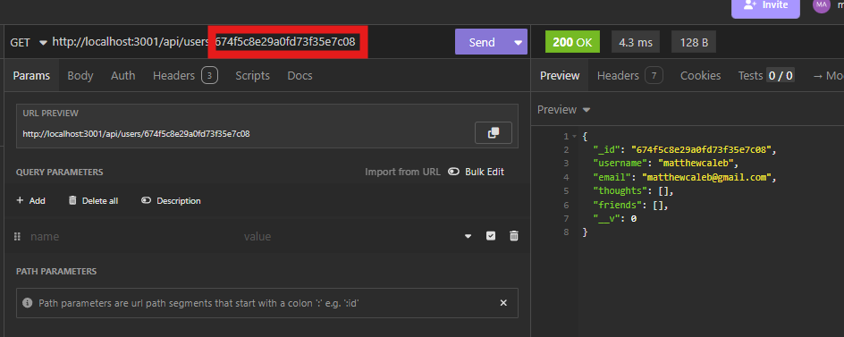
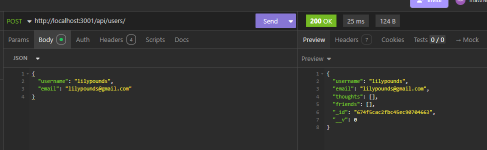
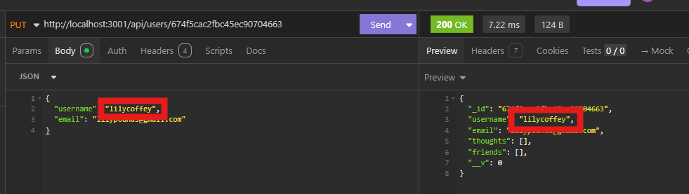
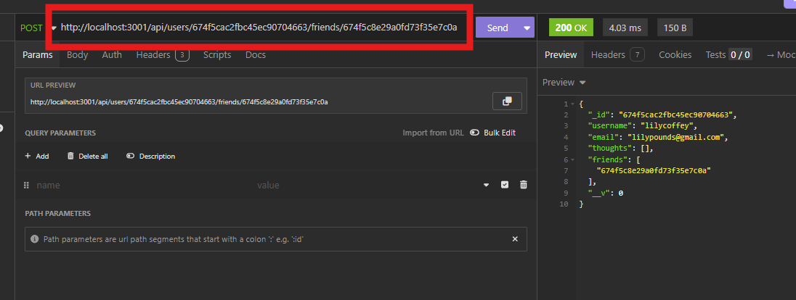
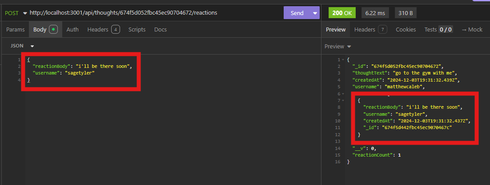

# MongoDB Social Media Backend

  
## Description

This backend server is designed to accomodate CRUD operations for a social media website. There are routes to get all users, get one user with a user id, and for users to add another user to their friends list. There are routes to get all thoughts created by users, get one thought by its id, and for users to add a reaction to a thought.

A walkthrough video demonstrating all of the routes in action can be found on [YouTube](https://youtu.be/UlDTjdNVx0o)

## Contents

- [Installation](#installation)
- [Usage](#usage)
- [Credits](#contributing)
- [License](#license)

## Installation

In order to run the backend server, you will first need to seed the data by running `npm run seed`, and then start the server by running `npm run dev`. You will then be able to open the server in Insomnia and test the routes. The server is set to run on `http://localhost:3001/` by default.

## Usage

### GET and POST routes for Users and Thoughts

The get all routes work by calling the url for the api database, for example `http://localhost:3001/api/users/` or `http://localhost:3001/api/thoughts`. To fetch a single thought or user, you will need to input the user or thought id at the end of the route.

You can also post new users and thoughts to the `http://localhost:3001/api/users/` or `http://localhost:3001/api/thoughts` routes and the route will create a new document based on the information in the request body.

### PUT and DELETE routes for Users and Thoughts

Users and Thoughts can be edited by using the routes `http://localhost:3001/api/users/:userId/` or `http://localhost:3001/api/thoughts/:thoughtId/` respectively, where the `:userId` or `:thoughtId` is replaced with the id of the document desired to be changed. You will need to use the PUT route, and amend which aspects of the document desired to be changed in the request body.

You can also use these same routes with the DELETE route to remove that user or thoughts from the database entirely.

### Friend routes

Users can add friends by using the route `http://localhost:3001/api/users/:userId/friends/:friendId/`, where the `:userId` is their own id and the `:friendId` is the id of the user they wish to add to their friends list.

Users can delete a friend from their friends list by entering the same route they used to add the friend, but by using the DELETE route instead.

### Reaction routes

Reactions can be added to a thought by entering the `http://localhost:3001/api/thoughts/:thoughtId/reactions/` POST route, where `:thoughtId` is the id of the thought the user wants to add a reaction to. The request body should contain the reaction text and the username of the user adding the reaction.

A reaction can also be deleted from a thought by using the route `http://localhost:3001/api/thoughts/:thoughtId/reactions/:reactionId/` where the `:thoughtId` is the thought that houses the reaction and the `:reactionId` is the reaction desired to be removed. The reaction will be removed from the database

## Contributing

This project was coded independantly as an assignment for Vanderbilt University's coding bootcamp by github user mcellis1

## License

The project uses the MIT license. Refer to the [license document](./LICENSE) for more information.

## Questions

Questions about the project should be directed through the following contacts below.
Link to github profile: [mcellis1](https://github.com/mcellis1)
Email: [matthewcellis98@gmail.com](mailto:matthewcellis98@gmail.com)
